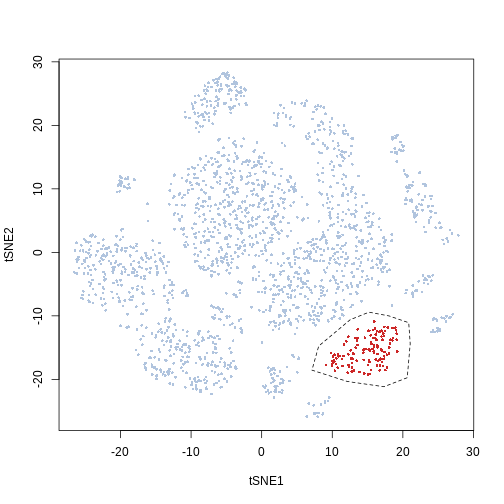
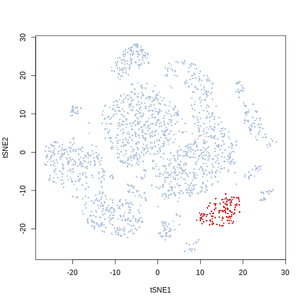
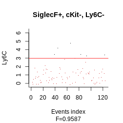
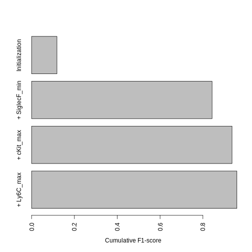
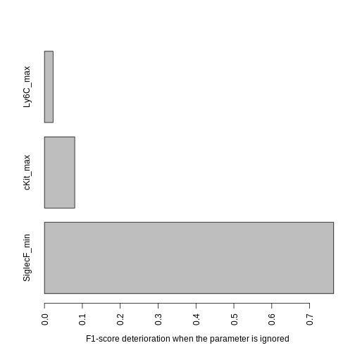
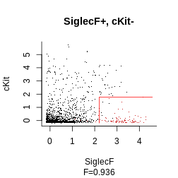

This Vignette will walk you through the usage of the Hypergate R package.

## Package installation
Installing dependencies:

```r
install.packages(c("sp", "polyclip", "rgeos"))
source("https://bioconductor.org/biocLite.R")
biocLite("flowCore")
```
Installing the package from github:

```r
install.packages("devtools")
library(devtools)
install_github(repo = "ebecht/hypergate")
```


```r
library(hypergate)
```

## Data loading


```r
data(Samusik_01_subset, package = "hypergate")
```

This loads 2000 datapoints randomly sampled from the *Samusik_01* dataset (available from FlowRepository accession number FR-FCM-ZZPH). This object is a list which includes as elements

1. *fs_src* a flowSet with 1 flowFrame corresponding to the data subset

2. *xp_src* a matrix corresponding to the expression of the data subset. Rownames correspond to event numbers in the unsampled dataset. Colnames correspond to protein targets (or other information e.g. events' manually-annotated labels)

3. *labels* numeric vector encoding manually-annontated labels, with the value -1 for ungated events. The text labels for the gated populations are availble from FlowRepostiry

4. *regular_channels* A subset of colnames(Samusik_01_subset$xp_src) that corresponds to protein targets

5. *tsne* A 2D-tSNE ran on the whole dataset and subsampled to 2000 events

## Specifying the cell subset of interest

Hypergate requires in particular as its arguments

1. an expression matrix (which we have as *Samusik_01_subset$xp_src*)

2. a vector specifying which events to attempt to gate on. This section discusses ways to achieve this point

#### Selection from low-dimensional plot
We included in the package a function with a rudimentary (hopefully sufficient) interface that allows for the selection of a cell subset of interest from a 2D biplot by drawing a polygon around it using the mouse. Since this function is interactive we cannot execute it in this Vignette but an example call would be as such (feel free to try it):


```r
g = gate_from_biplot(Samusik_01_subset$tsne, "tSNE1", "tSNE2")
```

For this tutorial we define manually the polygon instead


```r
x = c(12.54, 8.08, 7.12, 12.12, 17.32, 20.62, 21.04, 20.83, 18.07, 
    15.2)
y = c(-10.61, -14.76, -18.55, -20.33, -21.16, -19.74, -14.4, 
    -11.08, -10.02, -9.42)
pol = list(x = x, y = y)
library("sp")
gate_vector = sp::point.in.polygon(Samusik_01_subset$tsne[, 1], 
    Samusik_01_subset$tsne[, 2], pol$x, pol$y)
plot(Samusik_01_subset$tsne, pch = 16, cex = 0.5, col = ifelse(gate_vector == 
    1, "firebrick3", "lightsteelblue"))
polygon(pol, lty = 2)
```



#### Clustering

Another option to define a cell cluster of interest is to use the output of a clustering algorithm. Popular options for cytometry include *FlowSOM* (available from Bioconductor) or *Phenograph* (available from the ```cytofkit``` package from Bioconductor). An example call for Rphenograph is below:


```r
require(Rphenograph)
set.seed(5881215)
clustering = Rphenograph(Samusik_01_subset$xp_src[, Samusik_01_subset$regular_channels])
cluster_labels = membership(clustering[[2]])
```
In this Vignette we use the simpler kmeans option instead:


```r
set.seed(5881215)
cluster_labels = kmeans(Samusik_01_subset$tsne, 20, nstart = 100)$cluster
```

In this example we can see that the kmeans cluster *20* corresponds to the population we manually selected from the t-SNE biplot

```r
plot(Samusik_01_subset$tsne, col = ifelse(cluster_labels == 20, 
    "firebrick3", "lightsteelblue"), pch = 16, cex = 0.5)
```



## Running Hypergate

The function to optimize gating strategies is ```hypergate```. Its main arguments are ```xp``` (a numeric matrix encoding expression), ```gate_vector``` (a vector with few unique values), ```level``` (specificies what value of gate_vector to gate upon, i.e. events satisfying ```gate_vector==level``` will be gated in)


```r
hg_output = hypergate(xp = Samusik_01_subset$xp_src[, Samusik_01_subset$regular_channels], 
    gate_vector = gate_vector, level = 1, verbose = FALSE)
```

## Interpreting and polishing the results

### Gating datapoints

The following function allows to subset an expression matrix given a return from *Hypergate*. The new matrix needs to have the same column names as the original matrix.


```r
gating_predicted = subset_matrix_hg(hg_output, Samusik_01_subset$xp_src[, 
    Samusik_01_subset$regular_channels])
```


```r
table(ifelse(gating_predicted, "Gated-in", "Gated-out"), ifelse(gate_vector == 
    1, "Events of interest", "Others"))
```


|          | Events of interest| Others|
|:---------|------------------:|------:|
|Gated-in  |                116|      0|
|Gated-out |                 10|   1874|

Another option, which offers more low-level control, is to examine for each datapoint whether they pass the threshold for each parameter. The function to obtain such a boolean matrix is ```boolmat```. Here our gating strategy specifies *SiglecF+cKit-Ly6C-*. We would thus obtain a 3-columns x 2000 (the number of events) rows


```r
bm = boolmat(gate = hg_output, xp = Samusik_01_subset$xp_src[, 
    Samusik_01_subset$regular_channels])
head(bm)
```

```
##     SiglecF_min cKit_max Ly6C_max
## 20        FALSE     TRUE     TRUE
## 28        FALSE     TRUE     TRUE
## 70        FALSE    FALSE     TRUE
## 110        TRUE    FALSE    FALSE
## 120       FALSE     TRUE    FALSE
## 159       FALSE     TRUE    FALSE
```


|                             | Events of interest| Others|
|:----------------------------|------------------:|------:|
|Gated-out because of SiglecF |                  9|   1829|
|SiglecF above threshold      |                117|     45|

### Examining the output

The following function will plot the output of Hypergate. Arguments are

1. ```gate``` an object returned by Hypergate

2. ```xp``` an expression matrix whose columns are named similarly as the ones used to create the ```gate``` object

3. ```gate_vector``` and ```level``` to specify which events are "of interest"

4. ```highlight``` a color that will be used to highlight the events of interest 


```r
plot_gating_strategy(gate = hg_output, xp = Samusik_01_subset$xp_src[, 
    Samusik_01_subset$regular_channels], gate_vector = gate_vector, 
    level = 1, highlight = "firebrick3")
```



Another important point to consider is how the F$\beta$-score increases with each added channel. This gives an idea of how many channels are required to reach a close-to-optimal gating strategy.

This will identify at which steps the parameters were first activated and optimized:

```r
f_values_vs_number_of_parameters = c(F_beta(rep(TRUE, nrow(Samusik_01_subset$xp_src)), 
    gate_vector == 1), hg_output$f[c(apply(hg_output$pars.history[, 
    hg_output$active_channels], 2, function(x) min(which(x != 
    x[1]))) - 1, nrow(hg_output$pars.history))][-1])
barplot(rev(f_values_vs_number_of_parameters), names.arg = rev(c("Initialization", 
    paste("+ ", sep = "", hg_output$active_channels))), las = 3, 
    mar = c(10, 4, 1, 1), horiz = TRUE, xlab = "Cumulative F1-score")
```



This graph tells us that the biggest increase is by far due to SiglecF+, while the lowest is due to Ly6C-.

### Channels contributions

The previous graph only shows how the F-value evolved during optimization, but what we really want to know is how much each parameter contributes to the final output (sometimes a parameter will have a big impact at the early steps of the optimization but will become relatively unimportant towards the end, if multiple other parameters collectively account for most of its discriminatory power). We use the following function to assess this, which measures how much performances lower when a parameter is ignored. The more the performances lower, the more important the parameter is.


```r
contributions = channels_contributions(gate = hg_output, xp = Samusik_01_subset$xp_src[, 
    Samusik_01_subset$regular_channels], gate_vector = gate_vector, 
    level = 1, beta = 1)
barplot(contributions, las = 3, mar = c(10, 4, 1, 1), horiz = TRUE, 
    xlab = "F1-score deterioration when the parameter is ignored")
```



### Reoptimize strategy

Since Ly6C contributes very little, we may want to ignore it to obtain a shorter gating strategy. We could keep the current threshold values for the other parameters, but it is best to re-compute the other thresholds to account for the loss of some parameters.
To do that we use the following function:


```r
hg_output_polished = reoptimize_strategy(gate = hg_output, channels_subset = c("SiglecF_min", 
    "cKit_max"), xp = Samusik_01_subset$xp_src[, Samusik_01_subset$regular_channels], 
    gate_vector = gate_vector, level = 1)
```

Finally, we get to plot our final strategy:


```r
plot_gating_strategy(gate = hg_output_polished, xp = Samusik_01_subset$xp_src[, 
    Samusik_01_subset$regular_channels], gate_vector = gate_vector, 
    level = 1, highlight = "firebrick3")
```



### Human-readable output

Thanks to a nice contribution for SamGG on github, there are three functions that make the outputs more readable:


```r
hgate_pheno(hg_output)
```

```
## [1] "SiglecF+, cKit-, Ly6C-"
```

```r
hgate_rule(hg_output)
```

```
## [1] "SiglecF >= 2.21, cKit <= 1.77, Ly6C <= 2.98"
```

```r
hgate_info(hg_output)
```

```
##             channels sign comp threshold
## SiglecF_min  SiglecF    +  >=   2.208221
## cKit_max        cKit    -  <=   1.770901
## Ly6C_max        Ly6C    -  <=   2.983523
```

```r
# Fscores can be retrieved when the same parameters given to
# hypergate() are given to hgate_info():
hg_out_info = hgate_info(hg_output, xp = Samusik_01_subset$xp_src[, 
    Samusik_01_subset$regular_channels], gate_vector = gate_vector, 
    level = 1)
hg_out_info
```

```
##             channels sign comp threshold     deltaF Fscore1D Fscore
## SiglecF_min  SiglecF    +  >=   2.208221 0.76351765   0.8125 0.8125
## cKit_max        cKit    -  <=   1.770901 0.07988981   0.1294 0.9360
## Ly6C_max        Ly6C    -  <=   2.983523 0.02267769   0.1809 0.9587
```

```r
# and formatted readily
paste0(hg_out_info[, "Fscore"], collapse = ", ")
```

```
## [1] "0.8125, 0.936, 0.9587"
```

## Final notes

Some comments about potential questions on your own projects (raised by QBarbier):

### Which channels to use as input?
Anything that would be relevant for a gating strategy should be used as an input. So usually any phenotypic channel would be included. If you know that you would not use certain parameters on subsequent experiments (for instance if the staining is intracellular and you plan to sort a live population and thus cannot permeabilize your cells), you should exclude the corresponding channels. I usually do not use channels that were used in pre-gating steps (e.g. CD45 for immune cells). Finally, if you plan to use flow cytometry and use hypergate on a CyTOF dataset, you probably want to discard the Cell_length channel.

### How big can the input matrix be?
It depends on how much RAM your computer has. If that is an issue I suggest downsampling to (e.g.) 1000 positive cells and a corresponding number of negative cells. The `hgate_sample` function can help you achieve this:


```r
set.seed(123)  ## Makes the subsampling reproducible
gate_vector = Samusik_01_subset$labels
subsample = hgate_sample(gate_vector = gate_vector, level = 5, 
    size = 100)  ## Subsample 100 events from population #5 (Classical monocytes), and a corresponding number of negative events
tab = table(ifelse(subsample, "In", "Out"), ifelse(Samusik_01_subset$labels == 
    5, "Positive pop.", "Negative pop."))
tab[1, ]/colSums(tab)  ## Fraction of subsampled events for positive and negative populations
```

```
## Negative pop. Positive pop. 
##     0.3204976     0.3205128
```

```r
xp = Samusik_01_subset$xp_src[, Samusik_01_subset$regular_channels]
hg = hypergate(xp = xp[subsample, ], gate_vector = gate_vector[subsample], 
    level = 5)  ## Runs hypergate on a subsample of the input matrix
gating_heldout = subset_matrix_hg(hg, xp[!subsample, ])  ## Applies the gate to the held-out data
table(ifelse(gating_heldout, "Gated in", "Gated out"), ifelse(Samusik_01_subset$labels[!subsample] == 
    5, "Positive pop.", "Negative pop."))
```

```
##            
##             Negative pop. Positive pop.
##   Gated in             37           192
##   Gated out          1110            20
```
